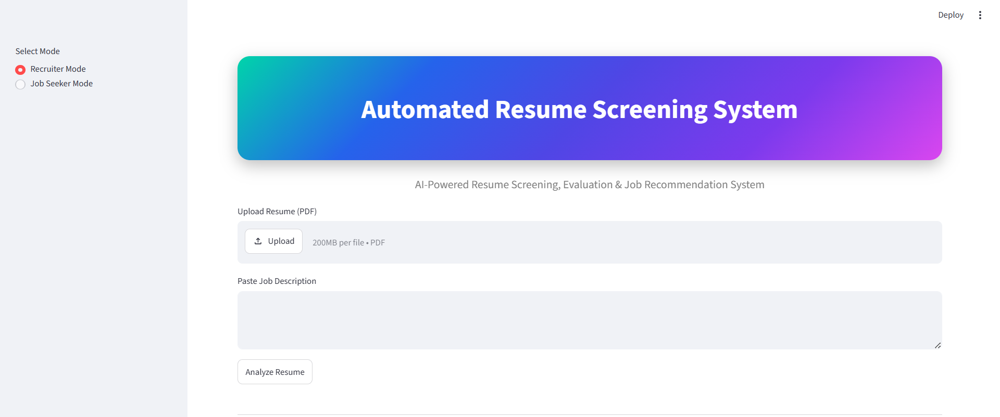
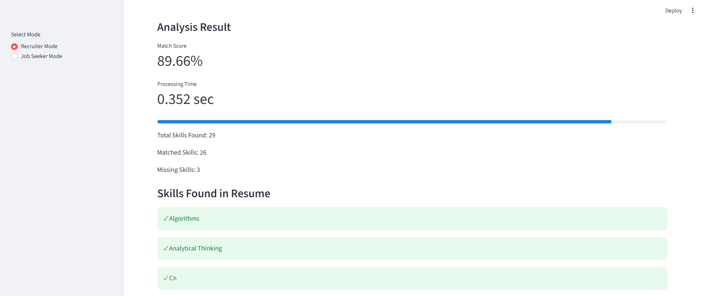

# AI-Powered Resume Screening, Candidate Evaluation & Job Recommendation System using Natural Language Processing (NLP)

## 📌 Project Overview

The **AI-Powered Resume Screening, Candidate Evaluation & Job Recommendation System** is a web-based application developed using **Python**, **Streamlit**, and **Natural Language Processing (NLP)**. The system automates resume analysis by extracting skills from uploaded PDF resumes, comparing them with job descriptions, calculating a resume-job match score, identifying missing skills, classifying candidate suitability, and recommending relevant job roles.

The application assists recruiters in evaluating candidates efficiently while enabling job seekers to analyze their resumes and discover suitable career opportunities.

---

## 🎯 Objectives

- Automate resume screening and candidate evaluation.
- Extract technical skills from resumes using NLP.
- Compare resume skills with job description requirements.
- Calculate resume-job compatibility score.
- Identify missing skills required for a job role.
- Classify candidate suitability based on the match score.
- Recommend suitable job roles according to extracted skills.

---

## 🚀 Features

### 👨‍💼 Recruiter Mode

- Upload candidate resume (PDF)
- Paste job description
- Automatic skill extraction
- Resume-job skill matching
- Match score calculation
- Matched skills identification
- Missing skills identification
- Candidate suitability classification

### 👨‍🎓 Job Seeker Mode

- Upload resume for analysis
- Automatic skill extraction
- Resume evaluation
- Job role recommendations
- Skill gap identification

### 📊 Evaluation Module

- Accuracy Calculation
- Precision Calculation
- Recall Calculation
- F1-Score Calculation
- Average Processing Time Measurement

---

## 🧠 NLP Techniques Used

The project utilizes **Natural Language Processing (NLP)** through the **SpaCy** library.

### Implemented NLP Operations

- Tokenization
- Lemmatization
- Stop-word Removal
- Text Normalization
- Rule-based Skill Extraction

These NLP preprocessing techniques improve the accuracy of extracting meaningful technical skills from resumes and job descriptions.

---

## 🛠️ Technologies Used

### Programming Language

- Python

### Frontend

- Streamlit

### NLP Library

- SpaCy

### Libraries

- Pandas
- PDFPlumber
- Scikit-learn

### Version Control

- Git
- GitHub

### Deployment

- Streamlit Community Cloud

---

## 📂 Project Structure

```text
Automated_Resume_Screening_System/
│
├── evaluation/
│   └── results.csv
│
├── Screenshots/
│   ├── Analysis-Result.png
│   ├── Select-Mode.png
│   ├── Upload Resume+JD.png
│   └── Verdict & JobRoles.png
│
├── .gitignore
├── app.py
├── evaluation.py
├── matcher.py
├── README.md
├── requirements.txt
├── resume_parser.py
├── skill_extractor.py
└── skills.csv
```

---

## 🔄 System Workflow

1. Upload a PDF resume.
2. Select either **Recruiter Mode** or **Job Seeker Mode**.
3. Enter the job description (Recruiter Mode).
4. Extract text from the uploaded resume.
5. Perform NLP preprocessing using SpaCy.
6. Extract skills from the resume.
7. Extract required skills from the job description.
8. Match extracted skills.
9. Calculate the resume-job compatibility score.
10. Display matched and missing skills.
11. Classify candidate suitability.
12. Recommend relevant job roles (Job Seeker Mode).
13. Store evaluation results for performance analysis.

---

## 📊 Candidate Suitability Criteria

| Match Score | Candidate Status |
|-------------|------------------|
| **80% and Above** | Highly Suitable Candidate |
| **60% – 79%** | Suitable Candidate |
| **40% – 59%** | Moderately Suitable Candidate |
| **Below 40%** | Not Suitable Candidate |

---

## 📈 Performance Evaluation

The system supports evaluation using the following performance metrics:

- Accuracy
- Precision
- Recall
- F1-Score
- Average Processing Time

Performance metrics can be generated after testing multiple resumes by executing:

```bash
python evaluation.py
```

---

## 📷 Application Screenshots

### 🎯 Mode Selection



### 📄 Resume Upload & Job Description


### 📊 Resume Analysis Result



### 🎯 Final Verdict & Job Recommendations


---

## 🌐 Live Demo

**Streamlit Application**

https://automated-resume-screening-system.streamlit.app

---

## 📦 GitHub Repository

https://github.com/bhashkarbiswas/Automated-Resume-Screening-System

---

## 💻 Installation

Clone the repository:

```bash
git clone https://github.com/bhashkarbiswas/Automated-Resume-Screening-System.git
```

Navigate to the project directory:

```bash
cd Automated-Resume-Screening-System
```

Install the required dependencies:

```bash
pip install -r requirements.txt
```

Run the application:

```bash
streamlit run app.py
```

---

## 📋 How to Perform Evaluation

1. Run the application.
2. Test multiple resumes against different job descriptions.
3. Open `evaluation/results.csv`.
4. Fill the **Actual_Label** column.
5. Execute:

```bash
python evaluation.py
```

The system computes:

- Accuracy
- Precision
- Recall
- F1-score
- Average Processing Time

---

## 🔮 Future Enhancements

- Semantic skill matching using Transformer-based NLP models.
- ATS compatibility analysis.
- Resume ranking for multiple candidates.
- Integration with online job portals.
- Resume improvement suggestions using Generative AI.
- Recruiter dashboard with authentication.
- Database integration for candidate management.

---

## 👨‍💻 Developer

**Bhashkar Biswas**

GitHub: https://github.com/bhashkarbiswas

---

## 📄 License

This project has been developed for **academic and educational purposes** as part of the **Master of Technology (M.Tech)** dissertation.
